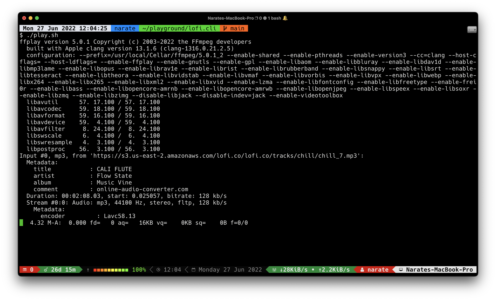

# lofi.cli
> Play [lofi.co](https://lofi.co) tracks from command line




## Requirement
- [ffplay](https://ffmpeg.org/ffplay.html)


## Play

Play all tracks

```
./play.sh
```

Play chill tracks

```
./play.sh chill
```

## Control

- **Exit**: Ctrl + C (on terminal)